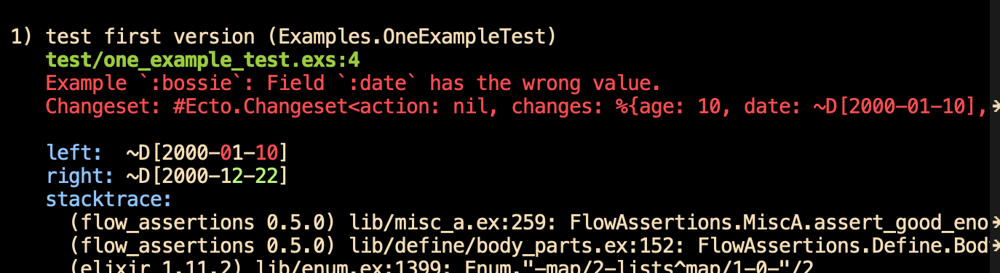
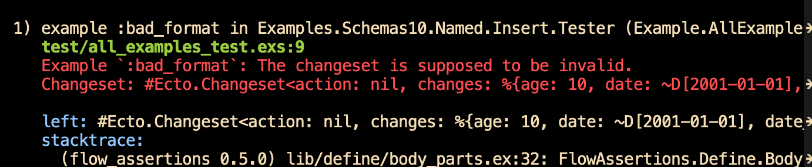
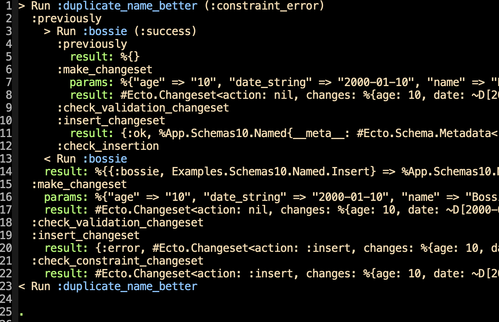
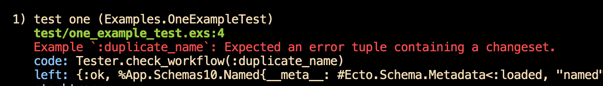

# A demonstration that I hope convinces you to read on


This demonstration, like all the ones in this how-to, uses [https://github.com/marick/tts\_ecto\_example](https://github.com/marick/tts_ecto_example). It's a sample project that contains Ecto schemas in the `lib` directory and example files in `test`. For this page, look at the schema in [`named.ex`](https://github.com/marick/tts_ecto_example/blob/main/lib/schemas_10_basics/named.ex)and the examples in [`named_10_insert_examples.ex`](https://github.com/marick/tts_ecto_example/blob/main/test/schemas_10_basics/named_10_insert_examples.ex)`.`



You can find instructions for setting up the library at its [Github page](https://github.com/marick/transformer_test_support). For `tts_ecto_example`, note that a server is started in [`test_helper.exs`](https://github.com/marick/tts_ecto_example/blob/main/test/test_helper.exs)and the [`mix.exs`](https://github.com/marick/tts_ecto_example/blob/main/mix.exs#L24) file instructs the compiler to compile`.ex` files within the`test` subdirectory. \(Example files end in`.ex.)`


Let's test the form-handling code for this structure, which is to be filled out with the data from an HTTP Post:

```elixir
defmodule App.Schemas10.Named do
  # ...

  schema "named" do
    field :name, :string    // must be unique
    field :age, :integer
    field :date_string, :string, virtual: true

    # calculated
    field :date, :date
    field :days_since_2000, :integer
    timestamps()
  end

  def changeset(struct, params) do # ...
```

There is one automatic conversion \(line 3: from a string to an integer\) and two calculated conversions: producing a `Date` value from a string \(line 7\) and then calculating the difference between that `Date` and the start of 2000 \(line 8\). 

In the rest of this page, we'll mostly testing the `changeset` function. In the jargon I'll use from now own, we'll be _**checking**_ particular _**examples**_ by passing input _**parameters**_ through a multi-step _**workflow**._ That's done in a single module, `Examples.Schemas10.Named.Insert`. It begins by providing a little information about what the module's examples are for. I won't describe all that here, but I suggest you skim it to get a first look at what kinds of things can be varied from module to module:

```elixir
  alias App.Schemas10.Named, as: Named
  use TransformerTestSupport.Variants.EctoClassic
  # ...
  
    start(
      module_under_test: Named,
      repo: App.Repo,
      action: :insert
    )
```

## The first example

Instead of worrying about setup, let's start with an example of successful insertion, which we'll name `:bossie`. That looks like this:

```elixir
defmodule Examples.Schemas10.Named.Insert do
# ...
  bossie: [
    params(name: "Bossie", age: 10, date_string: "2000-01-10"),
    changeset(changes: [
           name: "Bossie", age: 10, date_string: "2000-01-10",
           date: ~D[2000-01-10], days_since_2000: 9])
  ]
```

Line 4 gives the parameters provided by the outside world \(in this case, an HTML form\). For your convenience, the keys and values don't have to be strings. They'll be stringified for you so they look like the parameters Phoenix delivers to controllers,  which you can see like this:

```elixir
$ MIX_ENV=test iex -S mix
iex(1)> TransformerTestSupport.start
{:ok, #PID<0.300.0>}
iex(2)> alias Examples.Schemas10.Named.Insert.Tester
iex(3)> Tester.params(:bossie)
%{"age" => "10", "date_string" => "2000-01-10", "name" => "Bossie"}

```

You don't normally work with an example's params explicitly. Indeed, you typically only refer to a specific example when it's failing. A single test file \(I call it `all_examples_test.ex` \) tries all the examples. Its key line is this:

```elixir
  check_examples_in_files("test/*/*examples.ex")
```

That generates an ExUnit `test` for each example. \(That way, a failure in one example doesn't prevent other examples from being checked. Further, examples are isolated from each other using the usual `Ecto.Adapters.SQL.Sandbox` mechanism.\)

Checking `:bossie` means: 

1. Converting the given parameters into key/value strings.
2. Passing those strings into `Named.changeset` \(together with an empty `Named` struct\).
3. Checking the resulting changeset against the description given in the example \(shown below\).
4. Inserting the changeset with `App.Repo.insert` .
5. Checking that the result is an `{:ok, struct}` tuple. \(By default, the contents of the tuple aren't checked: we assume `Repo.insert` works.\)

Here's the example again:

```elixir
  bossie: [
    #...
    changeset(changes: [
           name: "Bossie", age: 10, date_string: "2000-01-10",
           date: ~D[2000-01-10], days_since_2000: 9])
  ]
```

`changeset` provides several concise notations for describing a changeset: not just which values should be in the changeset's `changes` map, but what values _shouldn't_ be there, what should be in the `error` structure, and so on.

As written, the `:bossie` example checks out, but here's what an error looks like:



Note that errors are reported in the usual ExUnit style, complete with colorized differences. When there's a changeset error, the changeset itself is also printed \(on a single line, to save space\). 

Once I find an error, I usually use `one_example_test.exs` when rerunning it \(and when using TDD to test-driven new code\). That looks like this:

```elixir
defmodule Examples.OneExampleTest do
  use App.EctoCase, async: true

  test "one" do 
    alias Examples.Schemas10.Named.Insert.Tester
    Tester.check_workflow(:bossie)
  end
end

```

#### Note

There's a lot of redundancy between the `params` and the `changes`:

```elixir
    params(name: "Bossie", age: 10, date_string: "2000-01-10"),
    changeset(changes: [
           name: "Bossie", age: 10, date_string: "2000-01-10",
           date: ~D[2000-01-10], days_since_2000: 9]
```

Do different examples have to keep saying that the resulting `changeset` has values the same as in the params? Or that the `date` is the `Date` version of `date_string`? These things are true for all \(valid\) examples, so why repeat them in each one?

In fact, you don't. Later, you'll learn how to state such facts once and only once. After that, lines 2 through 4 above could completely go away. The same changeset checks would be generated for you.

## Validation failures

Here's an example showing the handling of a misformatted `date_string`: 

```elixir
  bad_format: [
    params_like(:bossie, except: [date_string: "2001-01-0"]),
    changeset(
      no_changes: [:date, :days_since_2000],
      error: [date_string: "is not a valid date"]
    )]
```

Note the use of `params_like` on line 2. If you're testing an error case, you don't want to laboriously type in all the valid parameters. 

Again, just running this would produce no output because the example passes the check. However, suppose the `date_string` is changed to the valid `"2001-01-01"`:



#### Workflows

`:bossie` is an example that's expected to work all the way through insertion, whereas `:bad_format` is expected to produce an invalid changeset \(and will fail if it doesn't\). The difference between the two is that they have different _**workflows:**_

```elixir
    workflow(                                   :success,
      bossie: [
        # ...
      ]
    ) |>
    
    workflow(                                   :validation_error,
      bad_format: [
        # ...
      ]
    ) |>
```

## Database constraints

A third workflow expects the validation step to succeed but the `Repo.insert` call to fail. This example describes that it should fail when the same name is inserted twice:

```elixir
workflow(                                     :constraint_error,
  duplicate_name: [
    previously(insert: :bossie),
    params_like(:bossie),
    constraint_changeset(error: [name: "has already been taken"])
  ],
```

The `previously`on line 4 is somewhat like an ExUnit `setup` block. It's the first step in every workflow and is used to insert values into the database before the example is run. `constraint_changeset` \(line 5\) is similar to the earlier `changeset` , but it applies to the `{:error, changeset}` structure that `Repo.insert` can return. \(This example could also describe a verification changeset, but I didn't bother.\)

Uniqueness constraints are so common that Ecto has a special changeset function for them: `Changeset.unique_constraint`. Similarly, there's a function that's shorthand for lines 3 and 4 above, `insert_twice`, shown below on line 2:

```elixir
duplicate_name_better: [
  insert_twice(:bossie),
  constraint_changeset(error: [name: "has already been taken"])
])
```

## Debugging examples

Since each example is run through several functions, it's sometimes hard to understand what happened at steps before the failure. To help with that, you can turn on tracing:

```elixir
  test "one" do 
    alias Examples.Schemas10.Named.Insert.Tester
    Tester.check_workflow(:duplicate_name_better, trace: true)
  end                                             ###########
```

The result looks like this:



What this trace tells us is:

* **Line 1**: We're tracing the checking of `:duplicate_name_better` .
* **Line 2-14**: Before we can check that, we have to insert a `:bossie`. 
* **Line 4-5**: `:bossie` might have some setup work. As it happens, it doesn't, so the `result` is empty. The result of the `previously` step is a map of example names \(like `:bossie` \) to its value, which is in this case a `Named` structure. That mechanism is used most often to extract a primary key for use in an `update` form or an Ecto.Schema association. Those uses are shown elsewhere.
* **Line 6-8**: The `make_changeset` step shows the \(stringified\) params being processed and the resulting changeset.
* **Line 9**: Checks are applied to the changeset. Because checks are only used for the side effect of a possible assertion error, the result isn't shown.
* **Line 10-12:** The changeset is inserted with `Repo.insert` and checked for an `:ok` tuple.
* **Line 15-20:** The same kind of changeset-creation and insertion is done for `:duplicate_name_better`. 
* **Line 20-21**: Because `:duplicate_name_error` uses the `:constraint_error` workflow, `check_constraint_changeset` is used. Even if no changeset checks were described, it would still fail _unless_ the result of the previous step were an `{:error, changeset}` tuple. Such a failure would look like this:



